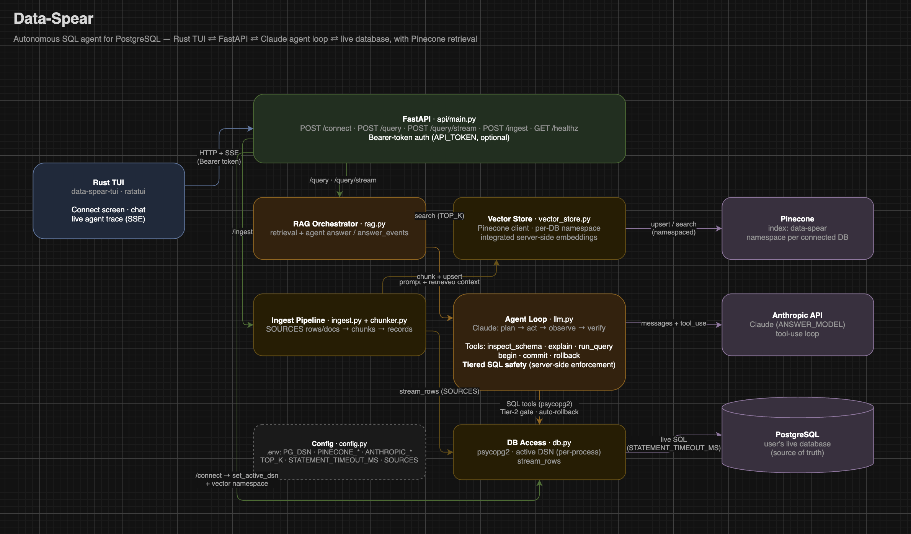
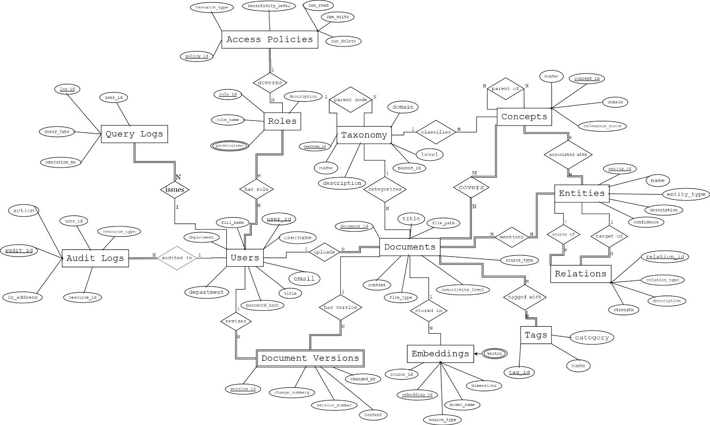

<div align="center">


# Data-Spear

<p>
  <a href="https://www.python.org/"></a>
  <a href="https://www.postgresql.org/"></a>
  <a href="https://www.pinecone.io/"></a>
  <a href="https://www.anthropic.com/"></a>
  <a href="https://www.rust-lang.org/"></a>
  <a href="https://www.docker.com/"></a>
</p>

**An autonomous SQL agent for PostgreSQL, in your terminal.**

</div>

---

Data-Spear answers questions about your database by **acting like an analyst, not a search box**: it plans, inspects schemas, runs live SQL, verifies its own results, and cites every claim. Retrieval (Pinecone) supplies context; the agent (Claude) treats the live database as the source of truth.

## Contents

- [Features](#features)
- [Architecture](#architecture)
- [SQL safety tiers](#sql-safety-tiers)
- [Quickstart](#quickstart)
- [TUI reference](#tui-reference)
- [API](#api)
- [Configuration](#configuration)
- [Docker](#docker)
- [License](#license)

## Features

- **Live agent trace** — every tool call streams into the TUI as it happens (`✓ run_query SELECT … → 12 rows`) and stays as an audit log.
- **Tiered SQL safety, enforced server-side** — reads run freely; bounded writes must be transaction-wrapped; destructive/DDL statements are rejected unless you explicitly authorize them. See [SQL safety tiers](#sql-safety-tiers).
- **Connect at startup** — point the TUI at any local or hosted Postgres (Neon, Supabase, RDS, …); credentials are validated before the chat opens.
- **Isolated retrieval** — vectors are namespaced per connected database, so context never leaks across databases.
- **Guardrails** — per-statement timeout, automatic rollback of unwrapped writes, optional bearer-token auth on the API.

## Architecture

<div>

</div>

| Component | Path | Role |
| --- | --- | --- |
| Rust TUI | [data-spear-tui/](data-spear-tui/) | Connection screen, chat, live agent trace (SSE) |
| API layer | [data_spear/api/main.py](data_spear/api/main.py) | FastAPI endpoints, bearer auth, active-DB switching |
| RAG orchestrator | [data_spear/rag.py](data_spear/rag.py) | Combines retrieval hits with the agent run |
| Agent loop | [data_spear/llm.py](data_spear/llm.py) | Claude plan → act → observe → verify; SQL tools and tier enforcement |
| Vector store | [data_spear/vector_store.py](data_spear/vector_store.py) | Pinecone client, per-DB namespacing, integrated embeddings |
| Ingest pipeline | [data_spear/ingest.py](data_spear/ingest.py), [data_spear/chunker.py](data_spear/chunker.py) | Streams `SOURCES` rows, chunks them, upserts records |
| DB access | [data_spear/db.py](data_spear/db.py) | psycopg2, per-process active DSN, row streaming |
| Config | [data_spear/config.py](data_spear/config.py) | `.env` settings and `SOURCES` declarations |

## SQL safety tiers

| Tier | Statements | Policy |
| --- | --- | --- |
| Read | `SELECT`, `EXPLAIN`, schema inspection | Run freely |
| Bounded write | `INSERT` / `UPDATE` / `DELETE` with a `WHERE` clause | Must be wrapped in `begin` … `commit`; unwrapped writes are rolled back automatically |
| Destructive (Tier 2) | DDL (`DROP`, `ALTER`, `CREATE`, `TRUNCATE`, `GRANT`, …) and `UPDATE` / `DELETE` without `WHERE` | Rejected unless the prompt is sent with a `!` prefix |

Enforcement happens server-side in the agent's tool dispatcher — the model cannot bypass it.

## Quickstart

Requirements: Python 3.14+, Rust toolchain, a PostgreSQL database, [Pinecone](https://www.pinecone.io/) and [Anthropic](https://console.anthropic.com/) API keys.

**1. Server**

```bash
python3 -m venv .venv
.venv/bin/pip install -r requirements.txt

cp .env.example .env          # fill in PINECONE_API_KEY and ANTHROPIC_API_KEY

.venv/bin/uvicorn data_spear.api.main:app --port 8000
```

**2. TUI** (separate terminal)

```bash
cd data-spear-tui
cargo run --release
```

Enter your database credentials on the connection screen (defaults target `localhost:5432/postgres`), then ask away.

**3. Optional: ingest context**

Declare which tables to index in `SOURCES` ([data_spear/config.py](data_spear/config.py)), then run `/ingest` from the TUI. The agent works without ingestion — it just leans on live queries instead of retrieval.

## API Endpoints

| Endpoint | Purpose |
| --- | --- |
| `POST /connect` | validate credentials, set the active database |
| `POST /query` | one-shot answer with sources |
| `POST /query/stream` | answer as Server-Sent Events (agent progress + final) |
| `POST /ingest` | index configured `SOURCES` into Pinecone |
| `GET /healthz` | liveness |

### Example database schema

A demo schema you can point Data-Spear at:

<div>

</div>

```bash
docker build -t data-spear .
docker run --rm -p 8000:8000 --env-file .env data-spear
```

> Keep `UVICORN_WORKERS=1` — the active database connection is per-process state.

## License

[MIT](LICENSE)
